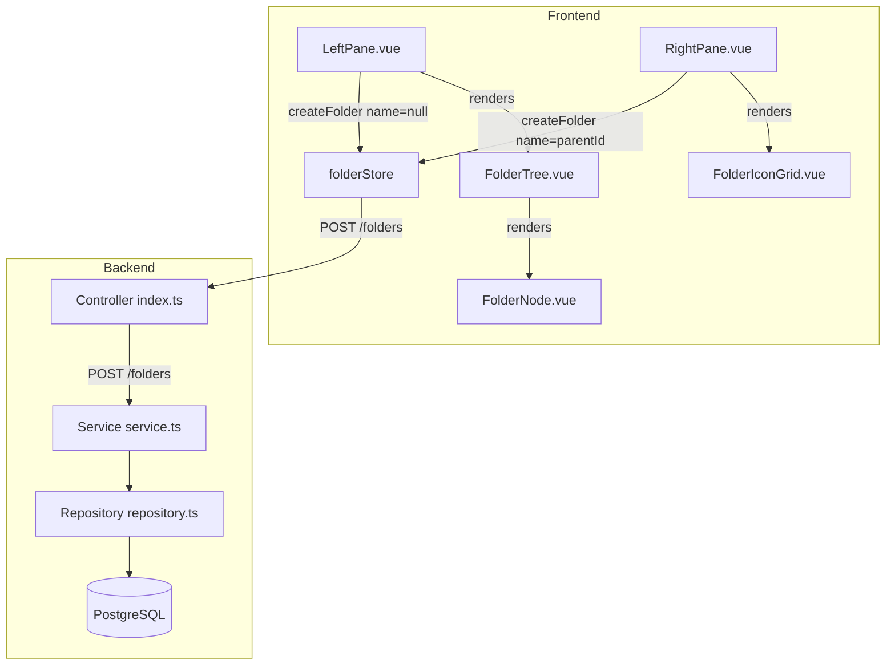

# Design Document — Create Folder

## Overview

The Create Folder feature adds end-to-end folder creation to the File Explorer. It spans three layers:

1. **Backend** — a new `POST /folders` endpoint with service and repository logic that inserts a folder and maintains the closure table in a single transaction.
2. **Pinia Store** — a new `createFolder` action that calls the API and updates normalized state (rootIds, childrenMap, folders map, fetchStatus).
3. **Frontend UI** — a Create Folder button in both panes that opens an inline name input; the Right Pane's existing `FolderChildTable` is replaced with a new `FolderIconGrid` component.

The design follows the existing layered module pattern: controller → service → repository on the backend, and component → store on the frontend. No new architectural patterns are introduced.

---

## Architecture



**Data flow for folder creation:**

1. User clicks Create Folder button → component sets `isCreating = true`, renders `InlineNameInput`.
2. User types a name and confirms → component calls `store.createFolder(name, parentId)`.
3. Store POSTs to `/folders`, receives the new `Folder`, updates state, returns the folder.
4. Component dismisses the input; reactive store state causes the tree / grid to re-render with the new folder.
5. On error (409 duplicate), the store re-throws; the component catches it and shows an inline error message.

---

## Components and Interfaces

### Backend

#### `POST /folders` — Controller (`index.ts`)

New route added to the existing `foldersModule`:

```typescript
.post(
  '/',
  async ({ body }) => {
    const data = await FolderService.createFolder(body.name, body.parentId ?? null)
    return new Response(JSON.stringify({ data }), { status: 201 })
  },
  { body: CreateFolderBodySchema }
)
```

- Delegates all business logic to `FolderService.createFolder`.
- TypeBox schema handles 400 for missing/invalid fields before the handler runs.
- `NotFoundError` (404) and `DuplicateNameError` (409) are handled by the existing global `onError` handler in `backend/src/index.ts` — no new error-handling code needed in the controller.

#### `CreateFolderBodySchema` — Model (`model.ts`)

```typescript
export const CreateFolderBodySchema = t.Object({
  name:     t.String({ minLength: 1 }),
  parentId: t.Optional(t.Union([t.String({ format: 'uuid' }), t.Null()])),
})
```

- `name` with `minLength: 1` causes ElysiaJS to return 400 for empty strings before the handler runs.
- Whitespace-only names pass TypeBox validation; the service trims and the repository rejects them (or the service validates after trim).
- `parentId` is optional; when absent it defaults to `null` in the handler.

> **Design decision**: Whitespace-only name rejection is enforced in the **service layer** (after trim) rather than in TypeBox, because TypeBox's `minLength` operates on the raw string. The service trims the name and throws a `ValidationError` if the result is empty. The global error handler maps `ValidationError` to 400.

#### `FolderService.createFolder` — Service (`service.ts`)

```typescript
static async createFolder(name: string, parentId: string | null): Promise<Folder> {
  const trimmed = name.trim()
  if (trimmed.length === 0) {
    throw new ValidationError('Folder name must not be empty or whitespace-only')
  }
  if (parentId !== null) {
    const exists = await FolderRepository.exists(parentId)
    if (!exists) throw new NotFoundError(`Folder '${parentId}' does not exist`)
  }
  return FolderRepository.insertFolder(trimmed, parentId)
}
```

#### `FolderRepository.insertFolder` — Repository (`repository.ts`)

Already implemented. Inserts the folder row and maintains the closure table in a single transaction. Catches PostgreSQL error code `23505` (unique violation) and re-throws as `DuplicateNameError`.

---

### Frontend

#### `folderStore.ts` — new `createFolder` action

```typescript
async function createFolder(name: string, parentId: string | null): Promise<Folder> {
  const response = await fetch(`${API_BASE_URL}/folders`, {
    method: 'POST',
    headers: { 'Content-Type': 'application/json' },
    body: JSON.stringify({ name, parentId }),
  })

  if (!response.ok) {
    const body: ApiError = await response.json()
    // Re-throw with the API error code so components can distinguish 409 from other errors
    const err = new Error(body.error.message) as Error & { code: string }
    err.code = body.error.code
    throw err
  }

  const body: ApiResponse<Folder> = await response.json()
  const folder = body.data

  // Normalize into store
  folders.value[folder.id] = folder
  fetchStatus.value[folder.id] = 'idle'

  if (parentId === null) {
    rootIds.value = [...rootIds.value, folder.id].sort(
      (a, b) => folders.value[a].name.localeCompare(folders.value[b].name)
    )
  } else if (fetchStatus.value[parentId] === 'loaded') {
    childrenMap.value[parentId] = [...(childrenMap.value[parentId] ?? []), folder.id]
  }
  // If parent not loaded, do not touch childrenMap — next fetchChildren will get the full list

  return folder
}
```

#### `InlineNameInput.vue` — new shared component

A small, focused component used by both panes:

```
Props:  { placeholder?: string }
Emits:  { confirm: (name: string) }, { cancel: () }
```

- Renders a text `<input>` with a confirm button (✓) and cancel button (✗).
- Auto-focuses on mount via `el.focus()` in `onMounted`.
- Emits `confirm` on Enter or confirm button click; emits `cancel` on Escape or cancel button click.
- Displays a `validationError` slot/prop for inline error messages.
- Does **not** call the store directly — the parent component owns the API call and error handling.

#### `FolderIconGrid.vue` — replaces `FolderChildTable.vue`

```
Props:  { children: FolderChild[], isCreating: boolean }
Emits:  { select: (folderId: string) }, { createConfirm: (name: string) }, { createCancel: () }
```

- Renders children as a CSS grid of folder icon cards (folder emoji + name label).
- When `isCreating` is true, renders an extra card at the end containing `InlineNameInput`.
- Double-click on a card emits `select` with the folder's id.
- Empty state: when `children` is empty and `isCreating` is false, shows "This folder is empty".

#### `RightPane.vue` — updated

- Replaces `<FolderChildTable>` with `<FolderIconGrid>`.
- Adds a "New Folder" button (shown only when `selectedFolder !== null`).
- Owns `isCreating`, `duplicateError` local state.
- On `createConfirm`: calls `store.createFolder(name, selectedFolderId)`, catches errors, sets `duplicateError` on 409.
- On `createCancel`: sets `isCreating = false`, clears `duplicateError`.
- On double-click (`select` event from grid): calls `store.selectFolder(folderId)`.

#### `LeftPane.vue` — updated

- Adds a "New Folder" button above the tree.
- Owns `isCreating`, `duplicateError` local state.
- Renders `InlineNameInput` at the bottom of the root list when `isCreating` is true.
- On confirm: calls `store.createFolder(name, null)`, handles errors.
- On cancel: dismisses input.

#### `FolderNode.vue` — minor update

The `isLeaf` computed property currently returns `true` when `fetchStatus === 'loaded' && children.length === 0`. After a child folder is created under a previously-leaf parent, the store appends to `childrenMap`, which makes `children.length > 0`, so `isLeaf` becomes `false` reactively — no code change needed. The expand toggle will appear automatically.

---

## Data Models

### New TypeBox schema (backend `model.ts`)

```typescript
export const CreateFolderBodySchema = t.Object({
  name:     t.String({ minLength: 1 }),
  parentId: t.Optional(t.Union([t.String({ format: 'uuid' }), t.Null()])),
})
```

### API contract

**Request**
```
POST /folders
Content-Type: application/json

{ "name": "Documents", "parentId": "uuid-or-null-or-omitted" }
```

**Success — 201**
```json
{ "data": { "id": "uuid", "name": "Documents", "createdAt": "2024-01-01T00:00:00.000Z" } }
```

**Error responses**

| Status | `code`           | Trigger                                      |
|--------|------------------|----------------------------------------------|
| 400    | `INVALID_UUID`   | `parentId` present but not a valid UUID      |
| 400    | `INVALID_UUID`   | `name` is empty or whitespace-only           |
| 404    | `NOT_FOUND`      | `parentId` is a valid UUID but doesn't exist |
| 409    | `DUPLICATE_NAME` | Name already exists at the same parent level |

> Note: The `ValidationError` class already has `code = 'INVALID_UUID'`. The global error handler maps it to 400. This is reused for whitespace-name rejection without adding a new error class.

### Frontend store additions

```typescript
// New action signature added to folderStore
createFolder(name: string, parentId: string | null): Promise<Folder>
```

No new state fields are required. The existing `folders`, `childrenMap`, `fetchStatus`, and `rootIds` are sufficient.

---

## Correctness Properties

*A property is a characteristic or behavior that should hold true across all valid executions of a system — essentially, a formal statement about what the system should do. Properties serve as the bridge between human-readable specifications and machine-verifiable correctness guarantees.*

### Property 1: Whitespace names are always rejected before reaching the API

*For any* string composed entirely of whitespace characters (spaces, tabs, newlines), submitting it as a folder name from either pane SHALL result in a validation error being displayed and the store's `createFolder` action SHALL NOT be called.

**Validates: Requirements 1.7, 2.7**

---

### Property 2: Root folder creation always uses parentId null

*For any* valid (non-whitespace) folder name entered in the Left Pane, when the user confirms, the store's `createFolder` action SHALL always be called with `parentId` equal to `null`.

**Validates: Requirements 1.4**

---

### Property 3: Child folder creation always uses the selected folder's id as parentId

*For any* valid folder name entered in the Right Pane and any selected folder, when the user confirms, the store's `createFolder` action SHALL always be called with `parentId` equal to the currently selected folder's id.

**Validates: Requirements 2.4**

---

### Property 4: Successful root creation always adds the folder to rootIds and folders map

*For any* valid folder name, after `createFolder(name, null)` succeeds, the returned folder SHALL appear in `rootIds` and in the `folders` map, and its `fetchStatus` SHALL be `'idle'`.

**Validates: Requirements 5.2, 5.6, 6.3**

---

### Property 5: Successful child creation with loaded parent always updates childrenMap

*For any* valid folder name and any parent whose children are already loaded (`fetchStatus === 'loaded'`), after `createFolder(name, parentId)` succeeds, the new folder SHALL appear in `childrenMap[parentId]` and in the `folders` map.

**Validates: Requirements 5.3**

---

### Property 6: Child creation with unloaded parent never modifies childrenMap

*For any* valid folder name and any parent whose children have NOT been fetched (status is not `'loaded'`), after `createFolder(name, parentId)` succeeds, `childrenMap[parentId]` SHALL remain unchanged (undefined or its prior value).

**Validates: Requirements 5.4**

---

### Property 7: Duplicate name errors never modify store state

*For any* folder name that triggers a 409 response from the API, the store's `folders` map, `childrenMap`, `rootIds`, and `fetchStatus` SHALL all remain identical to their state before the call.

**Validates: Requirements 5.5**

---

### Property 8: API always returns 201 with correct shape for valid inputs

*For any* non-empty, non-whitespace folder name and any valid `parentId` (null or UUID of an existing folder), `POST /folders` SHALL return HTTP 201 with a body matching `{ data: { id, name, createdAt } }`.

**Validates: Requirements 3.3**

---

### Property 9: API always returns 400 for whitespace-only names

*For any* string composed entirely of whitespace characters used as `name`, `POST /folders` SHALL return HTTP 400 with an `ApiError` body.

**Validates: Requirements 3.4**

---

### Property 10: API always returns 400 for non-UUID parentId

*For any* string that is not a valid UUID format used as `parentId`, `POST /folders` SHALL return HTTP 400 with an `ApiError` body.

**Validates: Requirements 3.5**

---

### Property 11: API always returns 404 for non-existent parentId

*For any* valid UUID that does not correspond to an existing folder used as `parentId`, `POST /folders` SHALL return HTTP 404 with `code: 'NOT_FOUND'`.

**Validates: Requirements 3.6**

---

### Property 12: API always returns 409 for duplicate names at the same level

*For any* folder name that already exists at the given parent level, `POST /folders` SHALL return HTTP 409 with `code: 'DUPLICATE_NAME'`.

**Validates: Requirements 3.7**

---

### Property 13: Closure table is always consistent after insertion

*For any* valid (name, parentId) pair, after `insertFolder` completes, the `folder_paths` table SHALL contain: (a) a self-referencing row `(newId, newId, 0)`, and (b) for each ancestor of `parentId` at depth `d`, a row `(ancestor, newId, d+1)`. When `parentId` is null, only the self-referencing row SHALL exist.

**Validates: Requirements 8.2, 8.3**

---

### Property 14: Repository always stores the trimmed name

*For any* folder name with leading or trailing whitespace, the name stored in the database SHALL equal `name.trim()`.

**Validates: Requirements 8.4**

---

### Property 15: Double-click on any grid item always selects that folder

*For any* folder displayed in the icon grid, double-clicking it SHALL call `store.selectFolder` with exactly that folder's id.

**Validates: Requirements 9.4**

---

### Property 16: Root folders list is always alphabetically sorted after creation

*For any* set of existing root folders and any new root folder name, after successful creation the `rootIds` array SHALL reflect an alphabetically sorted order by folder name.

**Validates: Requirements 6.2**

---

### Property 17: Newly created folders always have childCount of 0

*For any* folder returned by `POST /folders`, the `childCount` of that folder when subsequently fetched as a child SHALL be `0`.

**Validates: Requirements 7.2**

---

## Error Handling

### Backend

| Layer      | Error condition                        | Action                                                                 |
|------------|----------------------------------------|------------------------------------------------------------------------|
| TypeBox    | `name` empty string                    | 400 before handler runs                                                |
| TypeBox    | `parentId` not a UUID string           | 400 before handler runs                                                |
| Service    | `name.trim()` is empty                 | Throws `ValidationError` → global handler → 400                       |
| Service    | `parentId` UUID not in DB              | Throws `NotFoundError` → global handler → 404                         |
| Repository | Unique constraint violation (PG 23505) | Throws `DuplicateNameError` → global handler → 409                    |
| Repository | Any other DB error                     | Transaction rolled back, original error re-thrown → global handler → 500 |

The existing global `onError` handler in `backend/src/index.ts` already handles `NotFoundError`, `DuplicateNameError`, and `VALIDATION` code. The `ValidationError` class (code `INVALID_UUID`) is already mapped to 400. No changes to the global handler are needed.

### Frontend

| Scenario                        | Component behavior                                                                 |
|---------------------------------|------------------------------------------------------------------------------------|
| Whitespace-only name            | Validated locally; `createFolder` never called; inline validation message shown    |
| Network error / 500             | Error propagated; component shows a generic error message; input stays open        |
| 409 Duplicate name              | Component catches error with `code === 'DUPLICATE_NAME'`; shows inline error; input stays open with text preserved |
| 404 (parent not found)          | Unlikely in normal use; treated as generic error                                   |
| User cancels                    | `isCreating = false`; no API call; store unchanged                                 |

---

## Testing Strategy

### Unit tests (Vitest)

**Backend**
- `FolderService.createFolder`: verify `NotFoundError` thrown for non-existent parentId; verify `ValidationError` thrown for whitespace-only name; verify delegation to repository.
- `FolderRepository.insertFolder`: verify `DuplicateNameError` thrown on unique constraint; verify trimming; verify rollback on non-constraint errors (inject mock client).

**Frontend**
- `folderStore.createFolder`: mock `fetch`; verify state mutations for null parentId, loaded parent, unloaded parent, and 409 error cases.
- `InlineNameInput.vue`: verify auto-focus, Enter/Escape key handling, confirm/cancel emit.
- `FolderIconGrid.vue`: verify grid renders children, empty state, inline input card when `isCreating`, double-click emits `select`.
- `LeftPane.vue` / `RightPane.vue`: verify button visibility, creation flow, error display.

### Property-based tests (fast-check, minimum 100 iterations each)

Each property test is tagged with the design property it validates.

**Backend (Vitest + fast-check)**

- **Property 9** — `fc.string()` filtered to whitespace-only → always 400.
- **Property 10** — `fc.string()` filtered to non-UUID → always 400.
- **Property 11** — `fc.uuid()` not in DB → always 404.
- **Property 12** — insert name once, insert again → always 409.
- **Property 13** — `fc.string()` × `fc.option(fc.uuid())` → closure table rows verified after insert.
- **Property 14** — `fc.string()` with leading/trailing whitespace padding → stored name equals trimmed.

**Frontend (Vitest + fast-check)**

- **Property 1** — `fc.string()` filtered to whitespace-only → `createFolder` never called from either pane.
- **Property 2** — `fc.string({ minLength: 1 })` filtered to non-whitespace → `createFolder` always called with `(name, null)` from LeftPane.
- **Property 3** — `fc.string()` × `fc.uuid()` → `createFolder` always called with `(name, selectedId)` from RightPane.
- **Property 4** — `fc.string()` → after `createFolder(name, null)` succeeds, folder in `rootIds` and `folders`, status `'idle'`.
- **Property 5** — `fc.string()` × `fc.uuid()` (loaded parent) → folder in `childrenMap[parentId]`.
- **Property 6** — `fc.string()` × `fc.uuid()` (non-loaded parent) → `childrenMap[parentId]` unchanged.
- **Property 7** — `fc.string()` × mock 409 → store state unchanged.
- **Property 15** — `fc.array(fc.record({ id: fc.uuid(), name: fc.string() }))` → double-click always calls `selectFolder` with correct id.
- **Property 16** — `fc.array(fc.string())` as existing names + `fc.string()` as new name → `rootIds` sorted alphabetically after creation.

### Integration tests

- `POST /folders` end-to-end with a real (test) database: create root, create child, verify 201 and correct body.
- Verify 409 when inserting a duplicate name at the same level.
- Verify 404 when parentId does not exist.
