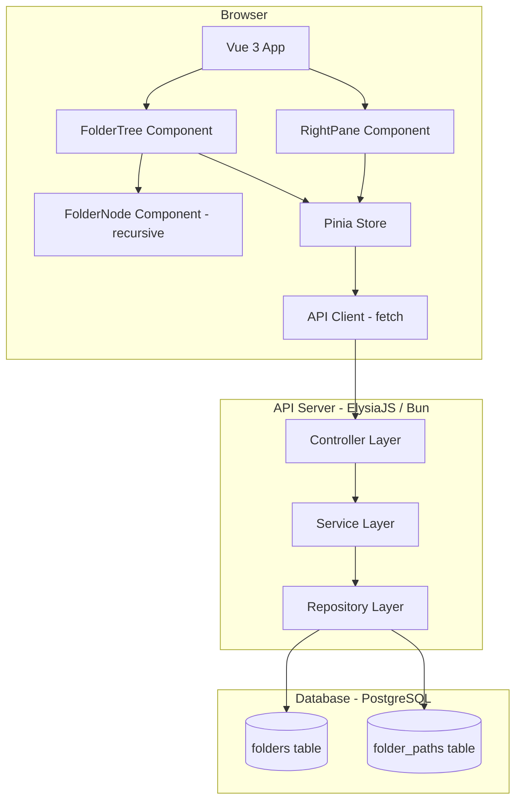
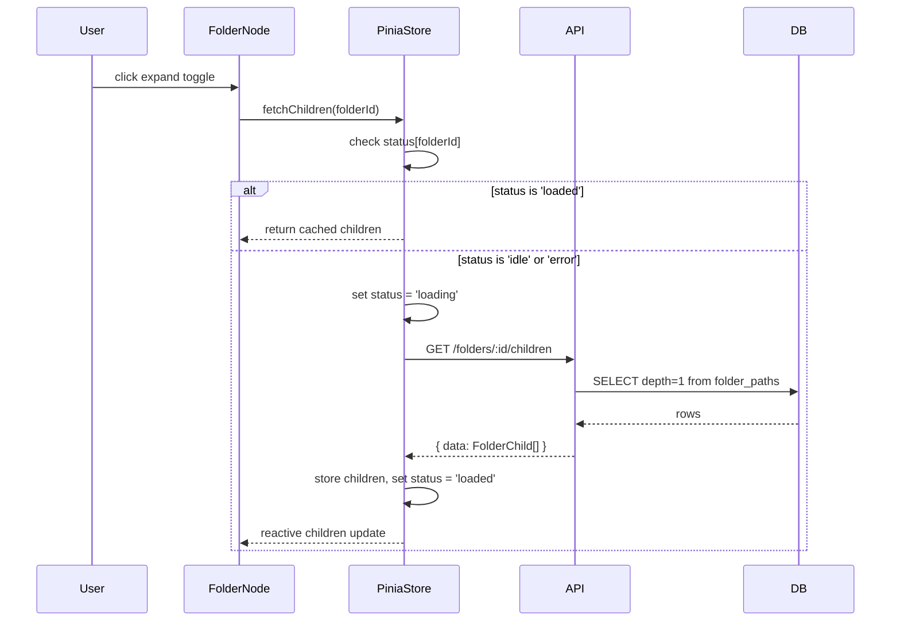

# Design Document — File Explorer

## Overview

The File Explorer is a full-stack web application that renders a hierarchical folder structure in a dual-pane layout. The left pane shows a recursive, lazily-loaded folder tree; the right pane shows the immediate children of the currently selected folder. The system is designed for unlimited depth with no upfront data loading — only root folders are fetched on mount, and children are fetched on demand when a folder is first expanded or selected.

### Key Design Decisions

| Decision | Choice | Rationale |
|---|---|---|
| Tree storage | PostgreSQL Closure Table | O(1) depth-agnostic child queries via `depth = 1` filter; no recursive CTEs needed at query time |
| Backend framework | ElysiaJS on Bun | Native TypeScript, fast startup, built-in schema validation via TypeBox |
| Frontend state | Pinia normalized map | Predictable, component-agnostic state; per-folder fetch status prevents duplicate requests |
| Tree component | Custom recursive Vue 3 SFC | Demonstrates algorithmic depth; avoids PrimeVue Tree/TreeSelect constraints |
| API type safety | Shared TypeScript types + response envelope | Single source of truth for `Folder`, `FolderChild`, `ApiError` shapes |

---

## Architecture

The system follows a strict three-tier architecture with a clear separation between the HTTP layer, business logic, and data access on the backend, and a component/store separation on the frontend.



### Request Flow — Lazy Load on Expansion



---

## Components and Interfaces

### Backend — ElysiaJS Module Structure

Following the ElysiaJS recommended feature-based structure:

```
src/
  modules/
    folders/
      index.ts          ← Controller (Elysia routes)
      service.ts        ← Service (business logic)
      repository.ts     ← Repository (SQL queries)
      model.ts          ← TypeBox schemas + TypeScript types
  shared/
    types.ts            ← Shared API types (Folder, FolderChild, ApiError)
    errors.ts           ← Typed error classes (NotFoundError, ValidationError)
  index.ts              ← App entry point, mounts modules
```

#### Controller (`folders/index.ts`)

Responsibilities: HTTP routing, request validation, response serialization, error mapping.

```typescript
// Route definitions (pseudo-code)
GET /folders
  → validates: nothing
  → delegates: FolderService.getRootFolders()
  → returns: ApiResponse<Folder[]>

GET /folders/:id/children
  → validates: params.id is UUID (400 if not)
  → delegates: FolderService.getChildren(id)
  → returns: ApiResponse<FolderChild[]>
  → maps NotFoundError → 404
```

#### Service (`folders/service.ts`)

Responsibilities: business logic, orchestration, error translation.

```typescript
abstract class FolderService {
  static getRootFolders(): Promise<Folder[]>
  static getChildren(id: string): Promise<FolderChild[]>
    // throws NotFoundError if id does not exist
}
```

#### Repository (`folders/repository.ts`)

Responsibilities: all SQL queries, no business logic.

```typescript
abstract class FolderRepository {
  static findRoots(): Promise<Folder[]>
  static findChildren(parentId: string): Promise<FolderChild[]>
  static exists(id: string): Promise<boolean>
  static insertFolder(name: string, parentId: string | null): Promise<Folder>
}
```

---

### Frontend — Vue 3 Component Tree

```
App.vue
  └── FileExplorer.vue          ← dual-pane layout container
        ├── LeftPane.vue         ← wraps FolderTree
        │     └── FolderTree.vue ← accepts rootFolders prop, renders FolderNode per root
        │           └── FolderNode.vue (recursive)
        │                 ├── expand toggle (chevron icon)
        │                 ├── folder name (clickable)
        │                 ├── loading spinner (v-if status === 'loading')
        │                 ├── error badge (v-if status === 'error')
        │                 └── FolderNode.vue × N (v-for children, recursive)
        └── RightPane.vue        ← displays children of selectedFolder
              └── FolderChildTable.vue
```

#### FolderTree Component

```typescript
// Props
interface FolderTreeProps {
  rootFolders: Folder[]
}
// Emits: none (delegates to store via FolderNode)
```

#### FolderNode Component

```typescript
// Props
interface FolderNodeProps {
  folder: Folder
  depth: number   // for indentation
}

// Internal state (setup())
const isExpanded = ref(false)
const store = useFolderStore()

// Computed
const children = computed(() => store.getChildren(props.folder.id))
const fetchStatus = computed(() => store.getFetchStatus(props.folder.id))
const isSelected = computed(() => store.selectedFolderId === props.folder.id)
const isLeaf = computed(
  () => fetchStatus.value === 'loaded' && children.value.length === 0
)

// Methods
function toggleExpand() { ... }  // fetches if needed, toggles isExpanded
function selectFolder() { ... }  // calls store.selectFolder(id)
```

Key implementation notes:
- The component references itself by its own `name` option (`name: 'FolderNode'`) to enable recursion in the template.
- `v-memo="[isSelected, isExpanded, fetchStatus]"` prevents re-rendering of unchanged nodes during bulk store updates.
- The expand toggle is hidden (`v-if="!isLeaf"`) once a folder is confirmed as a leaf.

#### Pinia Store Interface

```typescript
// useFolderStore()

// State
interface FolderStoreState {
  folders: Record<string, Folder>           // id → Folder
  childrenMap: Record<string, string[]>     // parentId → child id[]
  fetchStatus: Record<string, FetchStatus>  // id → 'idle'|'loading'|'loaded'|'error'
  selectedFolderId: string | null
  rootIds: string[]
}

type FetchStatus = 'idle' | 'loading' | 'loaded' | 'error'

// Actions
fetchRootFolders(): Promise<void>
fetchChildren(folderId: string): Promise<void>
selectFolder(folderId: string): Promise<void>

// Getters
getChildren(folderId: string): Folder[]
getFetchStatus(folderId: string): FetchStatus
selectedFolder: Folder | null
rootFolders: Folder[]
```

---

## Data Models

### Database Schema

```sql
-- Core folder table
CREATE TABLE folders (
  id         UUID PRIMARY KEY DEFAULT gen_random_uuid(),
  name       TEXT NOT NULL,
  created_at TIMESTAMPTZ NOT NULL DEFAULT now(),
  parent_id  UUID REFERENCES folders(id)
);

-- Closure table: stores every ancestor-descendant pair
CREATE TABLE folder_paths (
  ancestor   UUID NOT NULL REFERENCES folders(id) ON DELETE CASCADE,
  descendant UUID NOT NULL REFERENCES folders(id) ON DELETE CASCADE,
  depth      INTEGER NOT NULL CHECK (depth >= 0),
  PRIMARY KEY (ancestor, descendant)
);

-- Indexes for efficient child and ancestor lookups
CREATE INDEX idx_folder_paths_ancestor   ON folder_paths (ancestor, depth);
CREATE INDEX idx_folder_paths_descendant ON folder_paths (descendant);

-- Uniqueness: no two siblings may share the same name.
-- Two partial indexes are required because NULL != NULL in SQL, so a single
-- unique index on (parent_id, name) would not catch duplicate root names.
CREATE UNIQUE INDEX idx_folders_unique_name_per_parent
  ON folders (parent_id, name)
  WHERE parent_id IS NOT NULL;

CREATE UNIQUE INDEX idx_folders_unique_name_root
  ON folders (name)
  WHERE parent_id IS NULL;
```

**Closure Table invariants:**
- Every folder has a self-referencing row: `(id, id, 0)`.
- A direct parent-child relationship produces a row: `(parent, child, 1)`.
- All ancestor rows are propagated: when inserting a child under a parent, all rows where `descendant = parent` are copied with `descendant = child` and `depth + 1`.

**Insert child SQL pattern:**
```sql
-- Step 1: insert the folder row
INSERT INTO folders (name) VALUES (:name) RETURNING id;

-- Step 2: insert self-referencing closure row
INSERT INTO folder_paths (ancestor, descendant, depth)
VALUES (:newId, :newId, 0);

-- Step 3: propagate all ancestor relationships from parent
INSERT INTO folder_paths (ancestor, descendant, depth)
SELECT fp.ancestor, :newId, fp.depth + 1
FROM folder_paths fp
WHERE fp.descendant = :parentId;
```

**Query: direct children of a folder**
```sql
SELECT f.*
FROM folders f
JOIN folder_paths fp ON fp.descendant = f.id
WHERE fp.ancestor = :parentId
  AND fp.depth = 1;
```

**Query: root folders (no parent)**
```sql
SELECT f.*
FROM folders f
WHERE NOT EXISTS (
  SELECT 1 FROM folder_paths fp
  WHERE fp.descendant = f.id AND fp.depth > 0
);
-- Alternatively, using a parent_id column on folders for O(1) root lookup
```

> **Design note:** The `folders` table includes a `parent_id UUID REFERENCES folders(id)` column. This serves two purposes: it enables an efficient `WHERE parent_id IS NULL` query for root-folder lookups (avoiding a subquery on `folder_paths`), and it is required by the partial unique indexes that enforce sibling-name uniqueness. The Closure Table remains the authoritative source for all depth-based traversal.

### TypeScript Shared Types

```typescript
// shared/types.ts — used by both backend and frontend

export interface Folder {
  id: string        // UUID
  name: string
  createdAt: string // ISO 8601
}

export interface FolderChild extends Folder {
  childCount: number  // count of direct children (for right-pane display)
}

export interface ApiResponse<T> {
  data: T
}

export interface ApiError {
  error: {
    code: string    // e.g. 'NOT_FOUND', 'INVALID_UUID', 'INTERNAL_ERROR'
    message: string
  }
}
```

### TypeBox Validation Schemas (Backend)

```typescript
// folders/model.ts
import { t } from 'elysia'

export const FolderSchema = t.Object({
  id:        t.String({ format: 'uuid' }),
  name:      t.String(),
  createdAt: t.String({ format: 'date-time' }),
})

export const FolderChildSchema = t.Object({
  ...FolderSchema.properties,
  childCount: t.Number({ minimum: 0 }),
})

export const UUIDParamSchema = t.Object({
  id: t.String({ format: 'uuid' }),
})
```

---

## Correctness Properties

*A property is a characteristic or behavior that should hold true across all valid executions of a system — essentially, a formal statement about what the system should do. Properties serve as the bridge between human-readable specifications and machine-verifiable correctness guarantees.*

### Property 1: Folder serialization round-trip

*For any* valid `Folder` object serialized to JSON by the backend and then parsed by the frontend type definitions, the resulting object SHALL be structurally equivalent to the original — all fields (`id`, `name`, `createdAt`) retain their values and types.

**Validates: Requirements 10.4**

---

### Property 2: Closure Table child query returns only direct children

*For any* folder at any depth in any tree structure, querying `folder_paths` with `ancestor = folderId AND depth = 1` SHALL return exactly the set of folders that were inserted as direct children of that folder — no more, no less.

**Validates: Requirements 3.7, 5.4**

---

### Property 3: Closure Table insert propagates all ancestor rows

*For any* new folder inserted as a child of an existing folder at any depth, the `folder_paths` table SHALL contain a row `(a, newId, d+1)` for every existing row `(a, parentId, d)` in the table, plus the self-referencing row `(newId, newId, 0)`. The total number of new rows inserted equals the depth of the parent plus 2 (all ancestors + parent + self).

**Validates: Requirements 5.1, 5.2, 6.1, 6.2**

---

### Property 4: Pinia store fetch-children is idempotent for loaded folders

*For any* folder whose fetch status is `loaded`, dispatching `fetchChildren` again SHALL NOT issue a new API request, and the children list in the store SHALL remain unchanged.

**Validates: Requirements 3.5, 4.4, 9.5**

---

### Property 5: Pinia store normalized map consistency

*For any* sequence of `fetchRootFolders` and `fetchChildren` actions, every folder `id` present in `childrenMap` values SHALL also exist as a key in the `folders` map, and every folder's `fetchStatus` SHALL be one of `idle`, `loading`, `loaded`, or `error`.

**Validates: Requirements 9.1, 9.6**

---

### Property 6: UUID validation rejects non-UUID path parameters

*For any* string that is not a valid UUID v4, calling `GET /folders/:id/children` with that string SHALL return HTTP 400 with a structured `ApiError` body, and the Service Layer SHALL NOT be invoked.

**Validates: Requirements 10.5**

---

### Property 7: API response envelope is consistent

*For any* valid API request, the response SHALL be a JSON object with a `data` field containing the payload; and for any error condition (400, 404, 500), the response SHALL be a JSON object with an `error` field containing both a `code` string and a `message` string.

**Validates: Requirements 10.1, 10.2**

---

### Property 8: FolderNode toggle visibility reflects fetch state

*For any* folder, the FolderNode expand toggle SHALL be visible when the folder's fetch status is `idle` or `loading`, and SHALL be hidden when the fetch status is `loaded` and the children list is empty (confirmed leaf). When status is `loaded` and children list is non-empty, the toggle SHALL remain visible.

**Validates: Requirements 8.3, 8.4**

---

### Property 9: Right pane displays children of selected folder

*For any* selected folder whose children are in the Pinia store, the Right Pane SHALL render exactly the immediate children of that folder, each showing at minimum the folder name and direct child count.

**Validates: Requirements 1.3, 4.2, 4.5**

---

### Property 10: FolderTree renders one node per root folder

*For any* list of root folders passed as a prop to `FolderTree`, the component SHALL render exactly one top-level `FolderNode` for each entry in the list — no more, no less.

**Validates: Requirements 8.6**

---

### Property 11: Non-existent folder ID returns 404

*For any* UUID that does not correspond to an existing folder in the database, calling `GET /folders/:id/children` SHALL return HTTP 404 with a structured `ApiError` body.

**Validates: Requirements 7.5**

---

### Property 12: Closure Table delete cascades all related rows

*For any* folder deleted from the `folders` table, all rows in `folder_paths` where `ancestor` or `descendant` equals the deleted folder's `id` SHALL be removed, leaving no orphaned references.

**Validates: Requirements 6.5**

---

### Property 13: Duplicate folder name at the same level is rejected

*For any* attempt to insert a folder with a name that already exists under the same parent (or at the root level if `parentId` is null), the operation SHALL be rejected with a `DuplicateNameError` and no new row SHALL be inserted into `folders` or `folder_paths`.

**Validates: Requirements 11.1, 11.2, 11.3, 11.4, 11.6**

---

## Error Handling

### Backend Error Taxonomy

| Error Class | HTTP Status | `code` | Trigger |
|---|---|---|---|
| `ValidationError` | 400 | `INVALID_UUID` | `:id` param fails UUID format check |
| `NotFoundError` | 404 | `NOT_FOUND` | Folder `id` does not exist in DB |
| `DuplicateNameError` | 409 | `DUPLICATE_NAME` | Folder name already exists at the same level |
| Unhandled exception | 500 | `INTERNAL_ERROR` | Any uncaught error in Controller |

### Error Response Shape

All errors follow the `ApiError` envelope:
```json
{
  "error": {
    "code": "NOT_FOUND",
    "message": "Folder with id '...' does not exist"
  }
}
```

### ElysiaJS Error Handling

ElysiaJS provides a global `onError` lifecycle hook for centralized error handling:

```typescript
app.onError(({ code, error, set }) => {
  if (error instanceof NotFoundError) {
    set.status = 404
    return { error: { code: 'NOT_FOUND', message: error.message } }
  }
  if (error instanceof DuplicateNameError) {
    set.status = 409
    return { error: { code: 'DUPLICATE_NAME', message: error.message } }
  }
  if (code === 'VALIDATION') {
    set.status = 400
    return { error: { code: 'INVALID_UUID', message: 'Invalid UUID parameter' } }
  }
  // Log and return 500 for all unhandled errors
  console.error(error)
  set.status = 500
  return { error: { code: 'INTERNAL_ERROR', message: 'An unexpected error occurred' } }
})
```

### Frontend Error Handling

- Per-folder error state is stored in `fetchStatus[id] = 'error'` in the Pinia store.
- `FolderNode` renders an error badge with a retry button when `fetchStatus === 'error'`.
- Retrying calls `fetchChildren(id)` which resets status to `loading` and re-issues the request.
- Network errors and non-2xx responses both result in `error` status.

---

## Testing Strategy

### Dual Testing Approach

Both unit/example-based tests and property-based tests are used. Unit tests cover specific scenarios and integration points; property tests verify universal invariants across generated inputs.

### Backend Testing

**Unit Tests (Vitest)**
- Repository layer: mock `pg` client, verify correct SQL is issued for `findRoots`, `findChildren`, `insertFolder`
- Service layer: mock Repository, verify `NotFoundError` is thrown for unknown IDs
- Controller layer: use ElysiaJS `handle()` test utility to verify HTTP status codes and response shapes for valid/invalid inputs
- Example: unhandled exception in controller returns HTTP 500 with structured error body (Requirement 7.6)
- Example: `GET /folders` on mount triggers exactly one API call and no sub-folder fetches (Requirements 2.1, 2.2)

**Property-Based Tests (fast-check, minimum 100 iterations each)**

| Property | Test Description |
|---|---|
| Property 1 | Generate random `Folder` objects → `JSON.stringify` → `JSON.parse` → assert structural equivalence |
| Property 2 | Generate random tree structures, insert via Repository, call `findChildren`, assert exact depth=1 match |
| Property 3 | Generate random parent chains, insert child, assert all ancestor rows exist with correct depths |
| Property 4 | Generate store states with `loaded` folders, dispatch `fetchChildren`, assert no API call and unchanged children |
| Property 5 | Generate random sequences of fetch actions, assert all child IDs exist in `folders` map with valid status |
| Property 6 | Generate arbitrary non-UUID strings, call `GET /folders/:id/children`, assert 400 and no service invocation |
| Property 7 | Generate valid requests and error conditions, assert response envelope shape for both success and error |
| Property 11 | Generate random UUIDs not in DB, call `GET /folders/:id/children`, assert 404 with `ApiError` body |
| Property 12 | Generate random trees, delete a folder, assert no `folder_paths` rows reference the deleted ID |
| Property 13 | Generate folder names that already exist at a given level, attempt insert, assert `DuplicateNameError` is thrown and DB state is unchanged |

Tag format: `// Feature: file-explorer, Property N: <property_text>`

**Integration Tests**
- Spin up test PostgreSQL instance, run migrations, call API endpoints end-to-end
- Covers: `GET /folders` returns only roots; `GET /folders/:id/children` returns correct children at any depth; schema indexes exist (smoke)

### Frontend Testing

**Unit Tests (Vitest + Vue Test Utils)**
- `FolderNode`: shows spinner when `loading`; shows error badge when `error`; clicking calls `selectFolder` action
- `RightPane`: renders empty state when no folder selected; renders `FolderChildTable` when folder selected
- Pinia store: `fetchChildren` sets status to `error` on API failure; `fetchRootFolders` populates `rootIds`

**Property-Based Tests (fast-check, minimum 100 iterations each)**

| Property | Test Description |
|---|---|
| Property 8 | Generate folders with varying fetch status and children arrays, render `FolderNode`, assert toggle visibility matches rules |
| Property 9 | Generate random `FolderChild` arrays, set as selected folder's children in store, render `RightPane`, assert name and childCount are displayed for each |
| Property 10 | Generate random arrays of root folders (0–20 items), render `FolderTree`, assert exactly N `FolderNode` components are rendered |

Tag format: `// Feature: file-explorer, Property N: <property_text>`

**No PrimeVue Tree/TreeSelect components are used.** PrimeVue is used only for layout primitives (Splitter, DataTable, icons).
