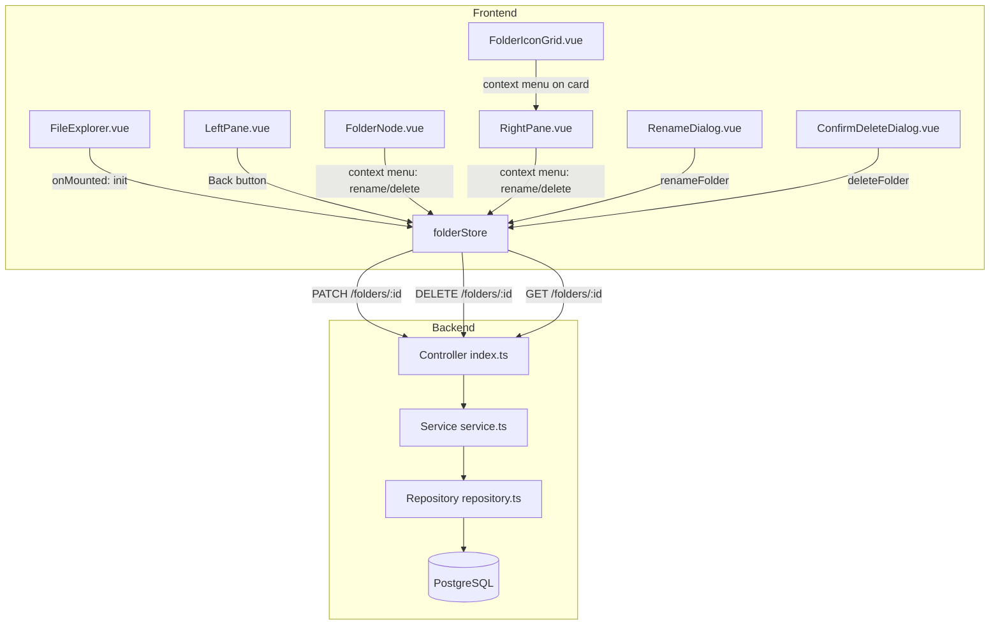

# Design Document — Folder Management Enhancements

## Overview

This feature adds four enhancements to the File Explorer on top of the existing create-folder foundation:

1. **Rename a Folder** — `PATCH /folders/:id` endpoint; inline rename dialog in the UI that pre-fills the current name, validates locally, and updates normalized store state on success.
2. **Delete a Folder** — `DELETE /folders/:id` endpoint; confirmation dialog; cascading delete of the folder and all descendants (including closure-table rows) in a single transaction; store cleanup of all affected IDs.
3. **Navigate Back** — A `navigationHistory` stack in the Pinia store; a Back button in the toolbar that is active when the stack is non-empty and disabled when empty; deleted-folder skipping on pop.
4. **Persist Selection** — `localStorage` persistence of `selectedFolderId`; `GET /folders/:id` endpoint for existence verification on init; graceful fallback when the persisted folder no longer exists.

The design follows the same layered module pattern already established: controller → service → repository on the backend, and component → store on the frontend. No new architectural patterns are introduced.

---

## Architecture



**Data flow — rename:**
1. User right-clicks a folder → context menu → "Rename" → `RenameDialog` opens pre-filled with current name.
2. User submits → store calls `PATCH /folders/:id` → on success, store updates `folders[id].name` → tree and right pane re-render reactively.

**Data flow — delete:**
1. User right-clicks a folder → "Delete" → `ConfirmDeleteDialog` opens.
2. User confirms → store calls `DELETE /folders/:id` → on 204, store removes the folder and all known descendants from `folders`, `childrenMap`, `fetchStatus`, `rootIds`; clears `selectedFolderId` if needed.

**Data flow — back navigation:**
1. `selectFolder(id)` pushes the previous `selectedFolderId` onto `navigationHistory` before updating.
2. User clicks Back → `navigateBack()` pops the stack, skipping any IDs that no longer exist in `folders`.

**Data flow — persist selection:**
1. `selectFolder(id)` writes `id` to `localStorage`.
2. On `FileExplorer` mount, `initializeStore()` reads `localStorage`, calls `GET /folders/:id` to verify, then calls `selectFolder` if valid.

---

## Components and Interfaces

### Backend

#### `GET /folders/:id` — Controller (`index.ts`)

```typescript
.get(
  '/:id',
  async ({ params }) => {
    const data = await FolderService.getFolder(params.id)
    return { data }
  },
  { params: UUIDParamSchema }
)
```

Returns the folder wrapped in `{ data: Folder }`. `NotFoundError` is mapped to 404 by the existing global handler.

#### `PATCH /folders/:id` — Controller (`index.ts`)

```typescript
.patch(
  '/:id',
  async ({ params, body }) => {
    const data = await FolderService.renameFolder(params.id, body.name)
    return { data }
  },
  { params: UUIDParamSchema, body: RenameFolderBodySchema }
)
```

Returns the updated folder wrapped in `{ data: Folder }`. `NotFoundError` → 404, `DuplicateNameError` → 409, `ValidationError` → 400 — all handled by the existing global handler.

#### `DELETE /folders/:id` — Controller (`index.ts`)

```typescript
.delete(
  '/:id',
  async ({ params, set }) => {
    await FolderService.deleteFolder(params.id)
    set.status = 204
  },
  { params: UUIDParamSchema }
)
```

Returns HTTP 204 with no body on success.

#### New TypeBox schemas — Model (`model.ts`)

```typescript
export const RenameFolderBodySchema = t.Object({
  name: t.String({ minLength: 1 }),
})
```

`minLength: 1` rejects empty strings at the TypeBox layer (400) before the handler runs. Whitespace-only names are caught in the service layer after trimming.

#### `FolderService.getFolder` — Service (`service.ts`)

```typescript
static async getFolder(id: string): Promise<Folder> {
  const folder = await FolderRepository.findById(id)
  if (!folder) throw new NotFoundError(`Folder with id '${id}' does not exist`)
  return folder
}
```

#### `FolderService.renameFolder` — Service (`service.ts`)

```typescript
static async renameFolder(id: string, name: string): Promise<Folder> {
  const trimmed = name.trim()
  if (trimmed.length === 0) {
    throw new ValidationError('Folder name must not be empty or whitespace-only')
  }
  const exists = await FolderRepository.exists(id)
  if (!exists) throw new NotFoundError(`Folder with id '${id}' does not exist`)
  return FolderRepository.updateName(id, trimmed)
}
```

`updateName` catches PostgreSQL error `23505` and re-throws as `DuplicateNameError`.

#### `FolderService.deleteFolder` — Service (`service.ts`)

```typescript
static async deleteFolder(id: string): Promise<void> {
  const exists = await FolderRepository.exists(id)
  if (!exists) throw new NotFoundError(`Folder with id '${id}' does not exist`)
  await FolderRepository.deleteSubtree(id)
}
```

#### `FolderRepository.findById` — Repository (`repository.ts`)

```typescript
static async findById(id: string): Promise<Folder | null> {
  const result = await pool.query<FolderRow>(
    `SELECT id, name, created_at FROM folders WHERE id = $1`,
    [id]
  )
  return result.rows[0] ? toFolder(result.rows[0]) : null
}
```

#### `FolderRepository.updateName` — Repository (`repository.ts`)

```typescript
static async updateName(id: string, name: string): Promise<Folder> {
  const result = await pool.query<FolderRow>(
    `UPDATE folders SET name = $1 WHERE id = $2 RETURNING id, name, created_at`,
    [name, id]
  )
  return toFolder(result.rows[0])
}
```

Catches `23505` unique violation and re-throws as `DuplicateNameError`.

#### `FolderRepository.deleteSubtree` — Repository (`repository.ts`)

Uses the closure table to identify all descendants, then deletes everything in a single transaction:

```typescript
static async deleteSubtree(id: string): Promise<void> {
  const client = await pool.connect()
  try {
    await client.query('BEGIN')

    // Collect all descendant IDs (including the target itself)
    const descendants = await client.query<{ descendant: string }>(
      `SELECT descendant FROM folder_paths WHERE ancestor = $1`,
      [id]
    )
    const ids = descendants.rows.map(r => r.descendant)

    // Delete closure-table rows where ancestor OR descendant is in the subtree
    await client.query(
      `DELETE FROM folder_paths
       WHERE ancestor = ANY($1::uuid[]) OR descendant = ANY($1::uuid[])`,
      [ids]
    )

    // Delete the folder rows themselves
    await client.query(
      `DELETE FROM folders WHERE id = ANY($1::uuid[])`,
      [ids]
    )

    await client.query('COMMIT')
  } catch (err) {
    await client.query('ROLLBACK')
    throw err
  } finally {
    client.release()
  }
}
```

> **Design decision**: Deleting closure-table rows first (before folder rows) avoids foreign-key constraint issues. The `folder_paths` table references `folders(id)` with `ON DELETE CASCADE` in the migration, but explicit deletion in the correct order is used here for clarity and to avoid relying on cascade behavior that could differ across environments.

---

### Frontend

#### `folderStore.ts` — new state and actions

**New state:**

```typescript
const navigationHistory = ref<string[]>([])
const SELECTED_FOLDER_KEY = 'fileExplorer:selectedFolderId'
```

**Modified `selectFolder` action:**

```typescript
async function selectFolder(folderId: string): Promise<void> {
  // Push current selection onto history stack before changing (Req 3.2)
  if (selectedFolderId.value !== null) {
    navigationHistory.value = [...navigationHistory.value, selectedFolderId.value]
  }

  selectedFolderId.value = folderId

  // Persist to localStorage (Req 4.1, 4.7)
  localStorage.setItem(SELECTED_FOLDER_KEY, folderId)

  if (getFetchStatus(folderId) !== 'loaded') {
    await fetchChildren(folderId)
  }
}
```

**New `navigateBack` action:**

```typescript
async function navigateBack(): Promise<void> {
  while (navigationHistory.value.length > 0) {
    const stack = [...navigationHistory.value]
    const previousId = stack.pop()!
    navigationHistory.value = stack

    // Skip deleted folders (Req 3.8)
    if (folders.value[previousId] !== undefined) {
      selectedFolderId.value = previousId
      localStorage.setItem(SELECTED_FOLDER_KEY, previousId)
      if (getFetchStatus(previousId) !== 'loaded') {
        await fetchChildren(previousId)
      }
      return
    }
  }
  // Stack exhausted — clear selection
  selectedFolderId.value = null
  localStorage.removeItem(SELECTED_FOLDER_KEY)
}
```

> **Design decision**: `navigateBack` does NOT push to `navigationHistory` itself — it only pops. This prevents the history from growing when going back, matching browser back-button semantics.

**New `initializeStore` action:**

```typescript
async function initializeStore(): Promise<void> {
  await fetchRootFolders()

  const persistedId = localStorage.getItem(SELECTED_FOLDER_KEY)
  if (!persistedId) return  // Req 4.6

  try {
    const response = await fetch(`${API_BASE_URL}/folders/${persistedId}`)
    if (!response.ok) {
      // Folder no longer exists — clear persisted value (Req 4.5)
      localStorage.removeItem(SELECTED_FOLDER_KEY)
      return
    }
    const body: ApiResponse<Folder> = await response.json()
    folders.value[body.data.id] = body.data
    fetchStatus.value[body.data.id] = fetchStatus.value[body.data.id] ?? 'idle'

    // Set selection directly (bypassing history push — this is a restore, not navigation)
    selectedFolderId.value = body.data.id
    await fetchChildren(body.data.id)  // Req 4.4
  } catch {
    localStorage.removeItem(SELECTED_FOLDER_KEY)
  }
}
```

> **Design decision**: `initializeStore` sets `selectedFolderId` directly rather than calling `selectFolder`, to avoid pushing `null` onto the navigation history stack during initialization.

**New `renameFolder` action:**

```typescript
async function renameFolder(folderId: string, newName: string): Promise<void> {
  const response = await fetch(`${API_BASE_URL}/folders/${folderId}`, {
    method: 'PATCH',
    headers: { 'Content-Type': 'application/json' },
    body: JSON.stringify({ name: newName }),
  })

  if (!response.ok) {
    const body: ApiError = await response.json()
    const err = new Error(body.error.message) as Error & { code: string }
    err.code = body.error.code
    throw err
  }

  const body: ApiResponse<Folder> = await response.json()
  // Update in-place — all computed properties referencing folders[id] update reactively
  folders.value[folderId] = body.data
}
```

**New `deleteFolder` action:**

```typescript
async function deleteFolder(folderId: string): Promise<void> {
  const response = await fetch(`${API_BASE_URL}/folders/${folderId}`, {
    method: 'DELETE',
  })

  if (!response.ok) {
    const body: ApiError = await response.json()
    const err = new Error(body.error.message) as Error & { code: string }
    err.code = body.error.code
    throw err
  }

  // Collect all known descendants to remove from store
  const toRemove = collectSubtreeIds(folderId)

  for (const id of toRemove) {
    delete folders.value[id]
    delete childrenMap.value[id]
    delete fetchStatus.value[id]
  }

  // Remove from parent's childrenMap entry
  for (const [parentId, children] of Object.entries(childrenMap.value)) {
    if (children.includes(folderId)) {
      childrenMap.value[parentId] = children.filter(id => id !== folderId)
      break
    }
  }

  // Remove from rootIds if applicable
  rootIds.value = rootIds.value.filter(id => !toRemove.has(id))

  // Clear selection if deleted folder was selected (Req 2.4)
  if (selectedFolderId.value !== null && toRemove.has(selectedFolderId.value)) {
    selectedFolderId.value = null
    localStorage.removeItem(SELECTED_FOLDER_KEY)
  }

  // Prune navigation history of deleted IDs (Req 3.8)
  navigationHistory.value = navigationHistory.value.filter(id => !toRemove.has(id))
}

/** Collects folderId and all known descendant IDs from the store's childrenMap. */
function collectSubtreeIds(folderId: string): Set<string> {
  const result = new Set<string>()
  const queue = [folderId]
  while (queue.length > 0) {
    const id = queue.shift()!
    result.add(id)
    const children = childrenMap.value[id] ?? []
    queue.push(...children)
  }
  return result
}
```

**New computed getter:**

```typescript
const canGoBack = computed((): boolean => navigationHistory.value.length > 0)
```

#### `RenameDialog.vue` — new component

```
Props:  { folder: Folder }
Emits:  { confirm: (newName: string) }, { cancel: [] }
```

- Renders a PrimeVue `Dialog` (modal) with a pre-filled `InlineNameInput` showing `folder.name`.
- Local whitespace validation before emitting `confirm`.
- Displays `DUPLICATE_NAME` and `NOT_FOUND` errors inline.
- Emits `cancel` on dialog close or Escape.

> **Design decision**: `RenameDialog` is a thin wrapper around `InlineNameInput` inside a PrimeVue `Dialog`. The parent component (FolderNode or RightPane) owns the `renameFolder` store call and error handling, keeping the dialog stateless with respect to API calls.

#### `ConfirmDeleteDialog.vue` — new component

```
Props:  { folder: Folder }
Emits:  { confirm: [] }, { cancel: [] }
```

- Renders a PrimeVue `Dialog` with the folder name and a warning that all sub-folders will be deleted.
- Two buttons: "Delete" (destructive, calls `confirm`) and "Cancel".
- No API call inside the component — the parent owns the `deleteFolder` store call.

#### `FolderNode.vue` — updated

- Adds a context menu (right-click or a `⋮` button) with "Rename" and "Delete" options.
- On "Rename": sets local `isRenaming = true`, renders `RenameDialog`.
- On "Delete": sets local `isDeleting = true`, renders `ConfirmDeleteDialog`.
- Handles errors from `renameFolder` / `deleteFolder` and shows them via a toast or inline message.

#### `FolderIconGrid.vue` — updated

- Each folder card gains a context menu (right-click or `⋮` button) with "Rename" and "Delete".
- Emits `rename: (folderId: string)` and `delete: (folderId: string)` to `RightPane`.

#### `RightPane.vue` — updated

- Handles `rename` and `delete` events from `FolderIconGrid`.
- Manages `renamingFolder: Folder | null` and `deletingFolder: Folder | null` local state.
- Renders `RenameDialog` and `ConfirmDeleteDialog` conditionally.

#### `LeftPane.vue` — updated

- Adds a Back button to the toolbar.
- Binds `:disabled="!store.canGoBack"` and `@click="store.navigateBack()"`.

#### `FileExplorer.vue` — updated

- Replaces `store.fetchRootFolders()` in `onMounted` with `store.initializeStore()`.

---

## Data Models

### New TypeBox schema (backend `model.ts`)

```typescript
export const RenameFolderBodySchema = t.Object({
  name: t.String({ minLength: 1 }),
})
```

### API contract

**`GET /folders/:id`**

| Status | Body | Trigger |
|--------|------|---------|
| 200 | `{ data: Folder }` | Folder found |
| 400 | `{ error: { code: 'INVALID_UUID', ... } }` | `:id` is not a valid UUID |
| 404 | `{ error: { code: 'NOT_FOUND', ... } }` | Folder does not exist |

**`PATCH /folders/:id`**

Request body: `{ "name": "New Name" }`

| Status | Body | Trigger |
|--------|------|---------|
| 200 | `{ data: Folder }` | Rename succeeded |
| 400 | `{ error: { code: 'INVALID_UUID', ... } }` | Empty/whitespace name or invalid UUID |
| 404 | `{ error: { code: 'NOT_FOUND', ... } }` | Folder does not exist |
| 409 | `{ error: { code: 'DUPLICATE_NAME', ... } }` | Name already exists at same parent level |

**`DELETE /folders/:id`**

| Status | Body | Trigger |
|--------|------|---------|
| 204 | (empty) | Deletion succeeded |
| 400 | `{ error: { code: 'INVALID_UUID', ... } }` | `:id` is not a valid UUID |
| 404 | `{ error: { code: 'NOT_FOUND', ... } }` | Folder does not exist |

### Frontend store additions

```typescript
// New state
const navigationHistory = ref<string[]>([])
const SELECTED_FOLDER_KEY = 'fileExplorer:selectedFolderId'

// New computed
const canGoBack = computed((): boolean => navigationHistory.value.length > 0)

// New / modified actions
initializeStore(): Promise<void>          // replaces fetchRootFolders call in FileExplorer
renameFolder(id: string, name: string): Promise<void>
deleteFolder(id: string): Promise<void>
navigateBack(): Promise<void>
// selectFolder — modified to push history and persist to localStorage
```

### localStorage schema

```
Key:   "fileExplorer:selectedFolderId"
Value: UUID string (the selected folder's id)
```

---

## Correctness Properties

*A property is a characteristic or behavior that should hold true across all valid executions of a system — essentially, a formal statement about what the system should do. Properties serve as the bridge between human-readable specifications and machine-verifiable correctness guarantees.*

### Property 1: Rename dialog always pre-fills the current folder name

*For any* folder object in the store, when the `RenameDialog` is rendered for that folder, the input field's initial value SHALL equal `folder.name`.

**Validates: Requirements 1.1**

---

### Property 2: PATCH /folders/:id always returns the updated folder for valid names

*For any* existing folder ID and any non-empty, non-whitespace name string, `PATCH /folders/:id` with `{ name }` SHALL return HTTP 200 with a body matching `{ data: { id, name, createdAt } }` where `data.name` equals the trimmed submitted name.

**Validates: Requirements 1.2, 1.8**

---

### Property 3: Successful rename always updates the folder name in the store

*For any* folder ID present in the store and any valid new name, after `renameFolder(id, name)` succeeds, `folders[id].name` SHALL equal the new name.

**Validates: Requirements 1.3**

---

### Property 4: Whitespace-only names are always rejected before reaching the API

*For any* string composed entirely of whitespace characters, submitting it as a rename SHALL result in a validation error being displayed and `renameFolder` SHALL NOT be called.

**Validates: Requirements 1.4**

---

### Property 5: PATCH /folders/:id always returns DUPLICATE_NAME for sibling name conflicts

*For any* two sibling folders at the same parent level, attempting to rename one to the other's exact name SHALL cause `PATCH /folders/:id` to return HTTP 409 with `code: 'DUPLICATE_NAME'`.

**Validates: Requirements 1.5**

---

### Property 6: PATCH and DELETE /folders/:id always return NOT_FOUND for non-existent IDs

*For any* valid UUID that does not correspond to an existing folder, both `PATCH /folders/:id` and `DELETE /folders/:id` SHALL return HTTP 404 with `code: 'NOT_FOUND'`.

**Validates: Requirements 1.6, 2.6**

---

### Property 7: Delete confirmation dialog always displays the folder name

*For any* folder object, when `ConfirmDeleteDialog` is rendered for that folder, the rendered output SHALL contain `folder.name`.

**Validates: Requirements 2.1**

---

### Property 8: DELETE /folders/:id always removes the entire subtree atomically

*For any* folder with any subtree structure, after `DELETE /folders/:id` returns HTTP 204, all descendant folder IDs (including the target) SHALL be absent from both the `folders` table and the `folder_paths` table.

**Validates: Requirements 2.2, 2.8**

---

### Property 9: Successful delete always removes the entire known subtree from the store

*For any* store state containing a folder with known descendants, after `deleteFolder(id)` succeeds, all IDs in the subtree SHALL be absent from `folders`, `childrenMap`, `fetchStatus`, and `rootIds`.

**Validates: Requirements 2.3**

---

### Property 10: Deleting the selected folder always clears the selection and removes it from history

*For any* folder ID that is currently set as `selectedFolderId`, after `deleteFolder(id)` succeeds, `selectedFolderId` SHALL be `null` and the ID SHALL not appear in `navigationHistory`.

**Validates: Requirements 2.4, 3.8**

---

### Property 11: Deleting a child always removes it from the parent's childrenMap entry

*For any* parent folder whose children are loaded (`fetchStatus === 'loaded'`) and any child folder in `childrenMap[parentId]`, after `deleteFolder(childId)` succeeds, `childrenMap[parentId]` SHALL not contain `childId`.

**Validates: Requirements 2.5**

---

### Property 12: selectFolder always pushes the previous selection onto navigationHistory

*For any* sequence of N folder selections (N ≥ 2), after each call to `selectFolder`, the `navigationHistory` stack SHALL contain the previously selected folder IDs in the order they were selected, and its length SHALL equal N − 1.

**Validates: Requirements 3.1, 3.2**

---

### Property 13: canGoBack reflects whether navigationHistory is non-empty

*For any* `navigationHistory` array, `canGoBack` SHALL be `true` if and only if the array has at least one entry.

**Validates: Requirements 3.3, 3.4**

---

### Property 14: navigateBack always pops the top valid entry and sets it as the selection

*For any* non-empty `navigationHistory` stack where all IDs are present in the `folders` map, calling `navigateBack()` SHALL set `selectedFolderId` to the top-most entry and reduce the stack length by exactly one.

**Validates: Requirements 3.5**

---

### Property 15: navigateBack always skips deleted IDs and lands on the first valid one

*For any* `navigationHistory` stack containing a mix of valid folder IDs (present in `folders`) and deleted IDs (absent from `folders`), calling `navigateBack()` SHALL set `selectedFolderId` to the first valid ID from the top of the stack, skipping all deleted IDs.

**Validates: Requirements 3.8**

---

### Property 16: selectFolder always persists the selected ID to localStorage

*For any* folder ID passed to `selectFolder`, after the call completes, `localStorage.getItem('fileExplorer:selectedFolderId')` SHALL equal that folder ID.

**Validates: Requirements 4.1, 4.7**

---

### Property 17: initializeStore always calls GET /folders/:id for any persisted ID

*For any* folder ID stored in `localStorage` under `'fileExplorer:selectedFolderId'`, calling `initializeStore()` SHALL issue a `GET /folders/:id` request with that ID.

**Validates: Requirements 4.2, 4.3**

---

### Property 18: initializeStore sets selection and fetches children when the persisted folder exists

*For any* folder ID in `localStorage` for which `GET /folders/:id` returns HTTP 200, after `initializeStore()` completes, `selectedFolderId` SHALL equal that ID and `fetchChildren` SHALL have been called for it.

**Validates: Requirements 4.4**

---

### Property 19: initializeStore clears localStorage and leaves no selection when the persisted folder is gone

*For any* folder ID in `localStorage` for which `GET /folders/:id` returns HTTP 404, after `initializeStore()` completes, `localStorage.getItem('fileExplorer:selectedFolderId')` SHALL be `null` and `selectedFolderId` SHALL be `null`.

**Validates: Requirements 4.5**

---

### Property 20: GET /folders/:id always returns the correct envelope for existing and non-existing IDs

*For any* existing folder ID, `GET /folders/:id` SHALL return HTTP 200 with `{ data: { id, name, createdAt } }`. *For any* valid UUID not in the database, it SHALL return HTTP 404 with `{ error: { code: 'NOT_FOUND', ... } }`.

**Validates: Requirements 4.8**

---

## Error Handling

### Backend

| Layer | Error condition | Action |
|-------|----------------|--------|
| TypeBox | `:id` not a valid UUID | 400 before handler runs (existing global handler maps `VALIDATION` → 400) |
| TypeBox | `name` empty string in PATCH body | 400 before handler runs |
| Service | `name.trim()` is empty (whitespace-only) | Throws `ValidationError` → global handler → 400 |
| Service | Folder ID not found (GET, PATCH, DELETE) | Throws `NotFoundError` → global handler → 404 |
| Repository | Unique constraint violation on rename (PG 23505) | Throws `DuplicateNameError` → global handler → 409 |
| Repository | Any other DB error in deleteSubtree | Transaction rolled back, error re-thrown → global handler → 500 |

The existing global `onError` handler in `backend/src/index.ts` already covers all these cases. No changes to the global handler are needed.

### Frontend

| Scenario | Component behavior |
|----------|--------------------|
| Whitespace-only rename | Validated locally; `renameFolder` never called; inline error shown in `RenameDialog` |
| `DUPLICATE_NAME` on rename | `RenameDialog` stays open; inline error message shown; input text preserved |
| `NOT_FOUND` on rename | `RenameDialog` shows error; folder may have been deleted concurrently; store refreshes root folders |
| `NOT_FOUND` on delete | Error toast shown; store state unchanged (folder was already gone) |
| Network error / 500 on rename or delete | Generic error message shown; store state unchanged |
| User cancels `RenameDialog` | `isRenaming = false`; no API call; store unchanged |
| User cancels `ConfirmDeleteDialog` | `isDeletingFolder = false`; no API call; store unchanged |
| Persisted folder gone on init | `localStorage` cleared; app starts with no selection; no error shown to user |

---

## Testing Strategy

### Unit tests (Vitest)

**Backend**
- `FolderService.renameFolder`: verify `ValidationError` for whitespace-only name; `NotFoundError` for non-existent ID; delegates to `FolderRepository.updateName`.
- `FolderService.deleteFolder`: verify `NotFoundError` for non-existent ID; delegates to `FolderRepository.deleteSubtree`.
- `FolderService.getFolder`: verify `NotFoundError` for non-existent ID; returns folder for existing ID.
- `FolderRepository.updateName`: verify `DuplicateNameError` on unique constraint; verify returned folder has updated name.
- `FolderRepository.deleteSubtree`: verify all descendant rows removed from both tables; verify rollback on error (inject mock client).
- `FolderRepository.findById`: verify returns `null` for non-existent ID; returns `Folder` for existing ID.

**Frontend**
- `folderStore` — `renameFolder`: mock `fetch`; verify `folders[id].name` updated on success; verify error re-thrown on 409/404.
- `folderStore` — `deleteFolder`: mock `fetch`; verify subtree removal from all state maps; verify `selectedFolderId` cleared when deleted folder was selected; verify `navigationHistory` pruned.
- `folderStore` — `navigateBack`: verify pop behavior; verify deleted-ID skipping; verify `fetchChildren` called for unloaded folders.
- `folderStore` — `selectFolder` (modified): verify `navigationHistory` push; verify `localStorage` write.
- `folderStore` — `initializeStore`: verify `GET /folders/:id` called for persisted ID; verify selection set on 200; verify `localStorage` cleared on 404.
- `RenameDialog.vue`: verify pre-filled input value; Enter/Escape handling; error display.
- `ConfirmDeleteDialog.vue`: verify folder name displayed; confirm/cancel emit.
- `LeftPane.vue`: verify Back button disabled when `canGoBack` is false; enabled when true; calls `navigateBack` on click.

### Property-based tests (fast-check, minimum 100 iterations each)

Each property test is tagged with the design property it validates.
Tag format: **Feature: folder-management-enhancements, Property {N}: {property_text}**

**Backend (Vitest + fast-check)**

- **Property 2** — `fc.string({ minLength: 1 })` filtered to non-whitespace as name → `PATCH /folders/:id` returns 200 with correct shape and updated name.
- **Property 5** — `fc.string()` as sibling name → insert two siblings, rename one to the other's name → always 409 `DUPLICATE_NAME`.
- **Property 6** — `fc.uuid()` not in DB → `PATCH` and `DELETE` both return 404 `NOT_FOUND`.
- **Property 8** — `fc.record({ children: fc.array(fc.record(...), { minLength: 0 }) })` as subtree → `DELETE /folders/:id` returns 204 and all descendant IDs absent from both tables.
- **Property 20** — existing IDs → 200 with correct shape; `fc.uuid()` not in DB → 404 `NOT_FOUND`.

**Frontend (Vitest + fast-check)**

- **Property 3** — `fc.uuid()` × `fc.string({ minLength: 1 })` filtered to non-whitespace → after `renameFolder` succeeds, `folders[id].name` equals new name.
- **Property 4** — `fc.string()` filtered to whitespace-only → `renameFolder` never called from `RenameDialog`.
- **Property 9** — `fc.array(fc.uuid(), { minLength: 1 })` as subtree IDs in store → after `deleteFolder` succeeds, all IDs absent from `folders`, `childrenMap`, `fetchStatus`, `rootIds`.
- **Property 10** — `fc.uuid()` set as `selectedFolderId` → after `deleteFolder`, `selectedFolderId` is `null` and ID absent from `navigationHistory`.
- **Property 11** — `fc.uuid()` as parent (loaded) × `fc.uuid()` as child → after `deleteFolder(childId)`, child absent from `childrenMap[parentId]`.
- **Property 12** — `fc.array(fc.uuid(), { minLength: 2 })` as selection sequence → after N `selectFolder` calls, `navigationHistory` contains the first N−1 IDs in order.
- **Property 13** — `fc.array(fc.uuid())` as history → `canGoBack` is `true` iff array is non-empty.
- **Property 14** — `fc.array(fc.uuid(), { minLength: 1 })` as history (all IDs in store) → `navigateBack` sets `selectedFolderId` to top entry and reduces stack by 1.
- **Property 15** — `fc.array(fc.uuid(), { minLength: 1 })` with some IDs absent from `folders` → `navigateBack` skips absent IDs and lands on first present one.
- **Property 16** — `fc.uuid()` → after `selectFolder`, `localStorage.getItem(SELECTED_FOLDER_KEY)` equals the ID.
- **Property 17** — `fc.uuid()` in `localStorage` → `initializeStore` calls `GET /folders/:id` with that ID.
- **Property 18** — `fc.uuid()` in `localStorage`, mock 200 response → after `initializeStore`, `selectedFolderId` equals ID and `fetchChildren` was called.
- **Property 19** — `fc.uuid()` in `localStorage`, mock 404 response → after `initializeStore`, `localStorage` cleared and `selectedFolderId` is `null`.

### Integration tests

- `PATCH /folders/:id` end-to-end: rename a folder, verify 200 and updated name in DB.
- `DELETE /folders/:id` end-to-end: create a subtree, delete root, verify all rows gone from `folders` and `folder_paths`.
- `GET /folders/:id` end-to-end: existing ID → 200; non-existent UUID → 404.
- Concurrent rename conflict: two requests rename different siblings to the same name; one should get 409.
